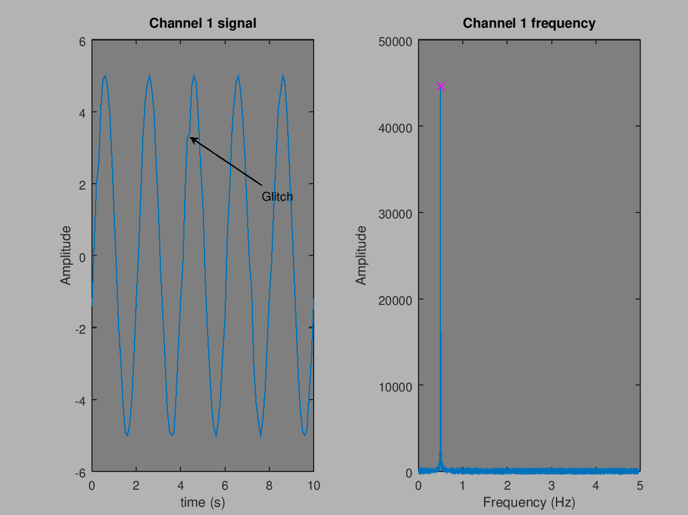
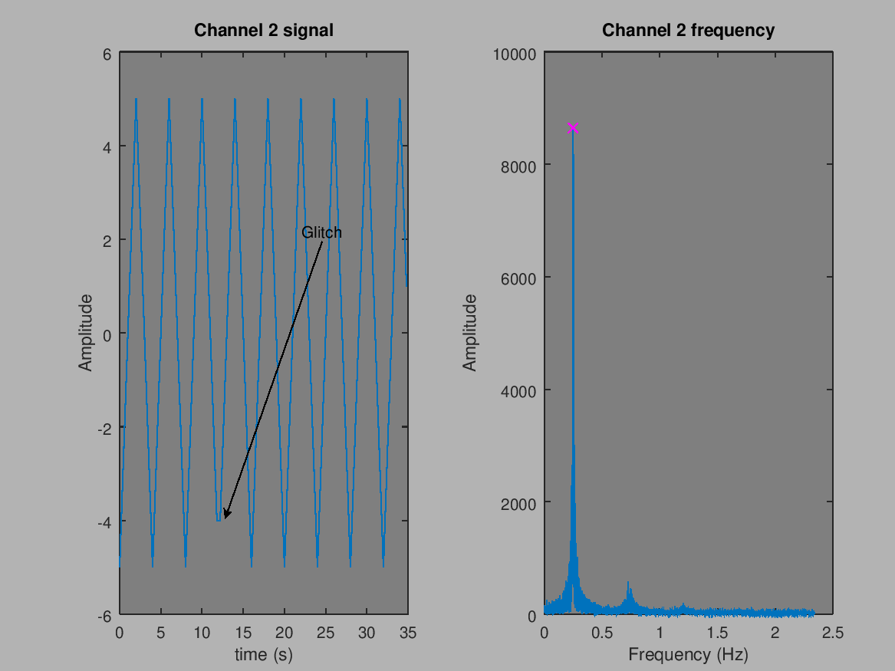
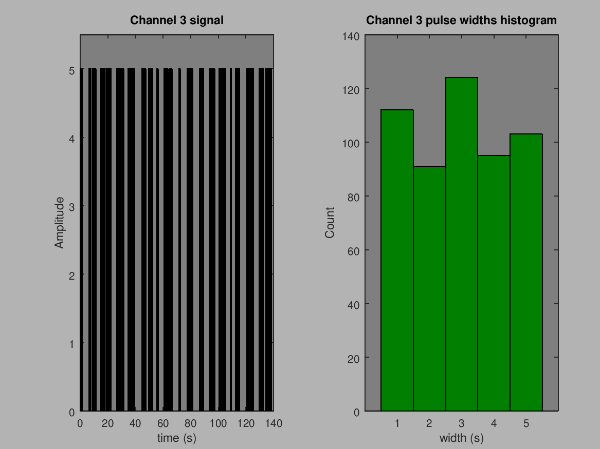

# Embedded Linux Homework Task

# Task 1

## Architectural choices

The nature of the work at hand presents three possible approaches.
1. Divide each socket connection to a pthread
2. Divide each socket connection to a forked process
3. Stay in one process and use a select/poll mechanism to multiplex work

The thread based option (1) with dependency to pthread library would probably have been against the spirit of the task. So it was discarded early on.
The classic choice (2) of forking a process for each connection wastes memory and resources. It also makes the execution flow of the program harder to follow and demands an additional cost as semaphores for data synchronization.
This lead me to pick the select/poll model (3) that has similar feel of execution flow (but not similar mechanics) as Go based channels. The execution flow is easy to follow. All actions are next to their error handling and nothing forces to jump between files while debugging. Costly semaphores can be avoided as pipes give us inherent synchronization.

At the heart of the program is a poll() call that waits for data or signals (from timer) to arrive. Another possibility would have been a select() call, which has less obvious control flow. There is also epoll() which would have been massive overkill and probably would have been against the spirit of the task.

As a design choice, comments outnumber code lines. At all decision points there is a discussion area where I offer alternative options. This is to make it easier for another person to debug or make changes to the code. This is a coding style for systems that have to run for 50 years and at the end of life will most likely be ported to a programming language that has not even been born yet.

The program is built on the expectation that serious errors are a valid reason for exit(). This depends on the design of the environment running the program. An embedded system might have only init/inittab keeping things running, but still it is better to solve serious errors through exit and restart than by building complex cleanup and recovery automation into the program itself.

Signals for timer and ctrl-c are caught and written to a pipe pair. This is an ultra simple way to synchronize the inherently asynchronous signals, making the control flow of the program as sequential as possible. It is also very friendly for a device that is in a resource constrained environment.

Another design choice was that all pipes and sockets are non-blocking. It is better in a small system to fail a read or write and let the main loop handle it as an error, than to block possibly indefinitely because something went wrong.

The program has been written with the main aim of readability because writing code is fast, reading it for debugging and feature addition is the hard part.

## Question from task definition
> What are the frequencies, amplitudes and shapes you see on the server outputs?

Two of the signals are frequency based, and the third is a series of impulses.
I converted the data from json format to tab separated values files using JQ to simplify analysis.
Example:
```bash
jq -r "[.timestamp, .out1] | @tsv" recording.js | grep -v "\-\-" > out1.tsv
```
After that I built a small signal analysis script with Octave to do FFT and pulse width analysis, and to plot graphs about them. The `analysis.m` file resides in the directory `signal_analysis`.

To stay in the spirit of the task, I have written the comments as if this were a real physical system that we needed to debug.

### Channel 1

Channel 1 seems to be a sinusoidal wave with amplitude from -5 to 5 and a frequency of 0.500 Hz.



There is a repeated glitch on the signal. It has been picked up on the image. It seems like a dropped packet to the DA-converter driving the signal. It does not seem to have imparted a phase error to the signal, but 10 Hz sampling makes it hard to say for certain. (Ramping up the sampling frequency could bring clarity, but I suspect that would not be in the spirit of the task.)

### Channel 2

Channel 2 seems to be a triangle wave with amplitude from -5 to 5 and a frequency of 0.249 Hz (The value is imprecise due to the small number of data points. Frequency most likely rounds to 0.250 Hz)



Also in this signal there is a repeated glitch. I have marked it with an arrow in the image. It seems like a dropped packet to the DA-converter driving the signal. It does not seem to have imparted a phase error to the signal, which is a relief.

### Channel 3

Channel 3 seems to be a series of impulses with 0 as minimum and 5 as impulse height. They seem to be roughly evenly distributed between 1 to 5 seconds of length. At first I suspected that the pulses might be non-return-to-zero encoded radio traffic that has bled to the sensor side, but on closer inspection it seems to be some form of control signal.




# Task 2

I wrote a group of small Python scripts for brute force analysis of the control protocol. They are in the directory `protocol_analysis`.
The script `hulk_smash_object.py` goes through all possible object numbers, and the `hulk_smash_property.py` does the same for property numbers. The `tap` scripts access only a single object or property for testing, and the `read_properties.py` goes through a group or property-numbers. These helper scripts made it possible to map the object names and their properties to be:
```properties
1.14:  enabled=1
1.170: amplitude=5000
1.255: frequency=500
1.300: glitch_chance=60
2.14:  enabled=1
2.170: amplitude=5000
2.255: frequency=250
2.300: glitch_chance=5
3.14:  enabled=1
3.42:  min_duration=1000
3.43:  max_duration=5000
```

This gave me enough ideas about how to proceed with the protocol.

The client2 program is just a few lines added to the the channel3 data stream handling. It is easiest to compare it to the Client1 program. The diff gives a clear idea what has been done.
Example of the diff:
```
git diff 3dc86c6 5b520a3
```

# Extra work
I am currently working to add client1 as a BuildRoot private package and as an Yocto private layer. This is purely for fun. If I like how they will look and there is interest I can push some results to this repository.
